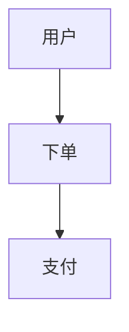

# PRD 需求文档生成器

分析任意项目代码，生成符合标准规范的 PRD 产品需求说明文档（MD格式）。

支持三种输入模式：
1. **项目路径** - 全量分析项目代码生成 PRD
2. **PRD文档路径** - 基于现有 PRD 文档进行增量更新
3. **功能需求描述** - 按描述要求生成 PRD

---

## 核心约束

1. **输出格式**：MD（Markdown）格式
2. **不主动创建总结文档**
3. 使用现有代码分析，禁止猜测
4. **通用性**：适用于任何技术栈的项目
5. **智能更新**：支持增量更新和全量更新
6. **UI字段检查**：对于UI页面相关功能，必须检查是否有详细的字段说明，避免AI幻读和猜测

---

## 入口逻辑

```
IF 输入是文件路径:
    IF 文件是 .md / .html / .txt:
        → 读取现有 PRD → 识别变动内容 → 增量更新 PRD
    ELSE IF 是项目目录:
        → 全量分析项目 + 数据库 → 生成 PRD
ELSE IF 输入是功能需求描述:
    → 按描述要求整理 → 生成 PRD
ELSE (无输入):
    IF 会话有逻辑变动:
        → 增量更新 PRD（识别关键词）
    ELSE:
        → 全量分析项目 + 数据库 → 生成 PRD
```

---

## 工作流程（8步 + 条件分支）

1. **检测输入类型** - 判断输入是文件路径/功能描述/无输入
2. **会话分析**（条件：无输入时执行）- 识别会话中的逻辑变动
3. **PRD文档更新模式**（条件：输入是PRD文档时执行）- 读取并更新指定文档
4. **数据库获取** - 按优先级获取数据库信息
5. **代码分析** - 扫描项目结构和功能模块
6. **UI字段检查** - 对于UI页面相关功能，检查字段说明避免幻读
7. **生成功能清单** - 输出功能需求表格
8. **生成/更新 PRD** - 增量或全量生成文档

---

## 第一步：检测输入类型

### 判断逻辑

根据输入内容判断处理模式：

| 输入类型 | 判断依据 | 处理模式 |
|---------|---------|---------|
| PRD文档路径 | 文件扩展名 `.md` / `.html` / `.txt` | 增量更新 PRD |
| 项目目录 | 包含常见项目文件（package.json, composer.json 等） | 全量分析项目 |
| 功能需求描述 | 纯文本描述 | 按描述生成 PRD |
| 无输入 | 无参数 | 按会话逻辑处理 |

### 文件路径检测

```bash
# 判断是否为文件
if [ -f "$输入" ]; then
    # 判断文件扩展名
    case "$输入" in
        *.md|*.html|*.txt)
            echo "PRD文档" ;;
        *)
            echo "未知文件类型" ;;
    esac
fi

# 判断是否为目录
if [ -d "$输入" ]; then
    echo "项目目录"
fi
```

### PRD文档更新模式

当输入是现有 PRD 文档时：
1. 读取 PRD 文档内容
2. 解析现有结构（功能清单、页面清单、业务流程）
3. 结合会话中的需求变动进行增量更新
4. 输出到原文档位置

### 无输入场景

继续判断是否有会话逻辑变动。

---

## 第三步：PRD文档更新模式（指定文档）

### 触发条件

用户输入了现有 PRD 文档路径（.md/.html/.txt）

### 处理流程

1. **读取现有 PRD**
   - 解析文档结构
   - 提取功能清单、页面清单、业务流程
   - 获取修订历史

2. **识别需求变动**
   - 从会话中提取新增/修改的功能
   - 识别要删除的功能
   - 标记流程变更

3. **增量更新**
   - 更新功能清单（新增/修改/删除）
   - 更新页面清单
   - 更新业务流程（如有变化）
   - 追加修订历史

4. **输出**
   - 覆盖原文件
   - 或输出到指定位置

### 支持的输入格式

- `.md` - Markdown 格式（推荐）
- `.html` - HTML 格式
- `.txt` - 纯文本格式

### 输出路径规则

| 输入路径 | 输出路径 |
|---------|---------|
| docs/PRD文档.md | docs/PRD文档.md（覆盖） |
| 自定义路径/xxx.md | 自定义路径/xxx.md |
| 仅有文件名 | docs/输入文件名 |

---

## 第二步：会话分析（识别逻辑变动）

### 触发条件

无输入时自动执行。

### 识别关键词

扫描当前对话消息，识别以下关键词：

| 关键词 | 示例 |
|--------|------|
| 新增 | 新增XX功能 |
| 添加 | 添加XX模块 |
| 修改 | 修改XX逻辑 |
| 优化 | 优化XX体验 |
| 调整 | 调整XX流程 |
| 变更 | 变更XX需求 |
| 功能 | XX功能 |
| 需求 | XX需求 |

### 输出

- 如果识别到变动：进入增量更新流程
- 如果未识别到变动：进入全量分析流程

---

## 第四步：数据库信息获取

### 获取优先级

1. **CLAUDE.md** - 读取数据库相关描述（表前缀、表结构说明）
2. **配置文件** - 读取 `.env` 或 `config/database.php`
3. **手动DDL** - 检查 `docs/` 目录下是否有 `.sql` 文件
4. **无数据库信息** - 跳过数据库分析

### 读取 CLAUDE.md

扫描文件内容，识别以下关键词：
- `数据库`
- `table`
- `表前缀`
- `yoshop_`
- `database`

### 读取配置文件

- `.env` - 查找 `DB_` 开头的配置
- `config/database.php` - 查找数据库连接配置
- `application.yml` - 查找数据库配置

### 读取 DDL 文件

扫描 `docs/` 目录，查找 `.sql` 文件。

---

## 第五步：扫描项目结构

### 扫描策略

根据项目目录结构自动识别技术栈和代码位置：

1. **识别项目根目录**：使用 `argument-hint` 传入的项目路径
2. **检测技术栈**：根据目录名和文件后缀判断（如 `src/`, `pages/`, `app/`, `controller/`, `api/`）
3. **扫描代码文件**：
   - 后端：`.php`, `.java`, `.py`, `.go`, `.js`, `.ts` 等
   - 前端：`.vue`, `.tsx`, `.jsx`, `.html` 等

### 扫描目标

| 层级 | 常见目录 | 扫描内容 | 对应PRD章节 |
|------|---------|----------|-------------|
| 后端API | `app/`, `controller/`, `api/`, `server/` | 控制器/接口 | 功能需求、页面清单 |
| 前端页面 | `pages/`, `views/`, `src/`, `components/` | 页面组件 | 页面清单 |
| 路由配置 | `router/`, `routes/`, `route/` | 路由定义 | 页面清单 |
| 模型/实体 | `model/`, `entity/`, `schema/` | 数据模型 | 功能需求 |

### 扫描命令示例

```bash
# 查看项目根目录结构
ls -la /项目路径/

# 扫描后端控制器（PHP框架）
find /项目路径 -name "*Controller.php" -o -name "*Controller.js"

# 扫描前端页面
find /项目路径 -name "*.vue" -o -name "*.tsx" | head -50

# 扫描路由配置
find /项目路径 -name "router*" -o -name "routes*"
```

---

## 第六步：分析功能模块

### 功能识别策略

根据代码文件自动识别功能模块：

1. **文件命名识别**：根据文件名推断功能（如 `Order.php` → 订单模块）
2. **目录结构识别**：根据目录名判断模块（如 `pages/cart/` → 购物车）
3. **路由定义识别**：根据路由路径推断页面功能
4. **代码注释识别**：根据 controller 方法注释提取功能描述

### 常见功能模块清单

根据项目类型（电商/SaaS/博客等），识别以下常见模块：

| 模块 | 识别关键词 | 常见文件名 | 优先级 |
|------|-----------|-----------|-------|
| 用户认证 | login, auth, passport, signin | Auth.php, Login.php, Passport.php | P0 |
| 用户管理 | user, profile, member | User.php, Member.php | P0 |
| 商品/内容 | goods, product, article, post | Product.php, Goods.php, Article.php | P0 |
| 购物车/收藏 | cart, favorite, wishlist | Cart.php, Favorite.php | P0 |
| 订单/交易 | order, transaction, trade | Order.php, Transaction.php | P0 |
| 支付/结算 | payment, pay, checkout, cashier | Payment.php, Checkout.php | P0 |
| 分类/导航 | category, classify, nav | Category.php, Nav.php | P1 |
| 评论/评价 | review, comment, rating | Review.php, Comment.php | P1 |
| 搜索 | search, query | Search.php | P1 |
| 设置/配置 | setting, config, option | Setting.php, Config.php | P1 |
| 统计/报表 | statistics, analytics, report | Statistics.php, Report.php | P2 |
| 消息/通知 | message, notification | Message.php, Notice.php | P2 |
| 权限/角色 | permission, role, admin | Permission.php, Role.php | P1 |

### 优先级定义

- **P0**：核心功能，用户/订单/支付等必须功能
- **P1**：重要功能，增强用户体验
- **P2**：辅助功能，可选实现

### 关键业务逻辑识别

从代码中识别核心业务流程：

1. **业务流程**：通过路由和方法名识别（如 `/order/create` → 创建订单）
2. **状态流转**：通过枚举或状态字段识别（如 `status`, `order_status`）
3. **关联关系**：通过模型关联识别（如 `hasMany`, `belongsTo`）

---

## 第七步：UI页面字段说明检查（防幻读）

### 触发条件

当识别的功能模块涉及 UI 页面时，必须执行此步骤。

### 识别 UI 页面相关功能

以下功能模块需要检查详细字段说明：
- 表单页面（登录、注册、提交、编辑）
- 列表页面（数据展示、筛选、排序）
- 详情页面（详情查看、详情编辑）
- 设置页面（配置项、开关、选项）

### 检查清单

对于 UI 页面相关功能，必须从代码中提取以下信息：

1. **表单字段检查**
   - 字段名称（从 v-model, name, prop 等属性提取）
   - 字段类型（input, select, checkbox, radio, date 等）
   - 必填/可选（从 required, rules 规则提取）
   - 校验规则（从 validator, pattern 提取）
   - 占位提示（从 placeholder 提取）
   - 默认值

2. **列表字段检查**
   - 列标题（从 label, title 提取）
   - 数据来源（从 dataIndex, prop, key 提取）
   - 排序/筛选（从 sorter, filter 提取）
   - 格式化（从 formatter, format 提取）

3. **交互状态检查**
   - 加载状态（loading, disabled）
   - 按钮文案
   - 弹窗/提示信息

### 代码提取位置

| 类型 | 提取位置 |
|------|---------|
| Vue组件 | `<template>` 中的 v-model, prop, label, placeholder 等属性 |
| 表单配置 | data() 中的 form 数据结构 |
| 校验规则 | rules 对象中的 validator, required, message |
| API请求 | methods 中的 axios/fetch 调用参数 |

### 防幻读原则

- **禁止猜测**：字段信息必须从代码中提取，不能凭想象
- **禁止脑补**：如果没有找到字段说明，在 PRD 中标记为「待确认」
- **标注来源**：在字段说明中标注数据来源（如：来自API响应 / 来自代码提取 / 待确认）

---

## 第八步：生成功能清单

### 输出格式

功能清单表格应包含：序号、功能模块、功能点、优先级、说明

```markdown
## 功能需求

### 2.1 功能清单

| 序号 | 功能模块 | 功能点 | 优先级 | 说明 |
|------|---------|--------|-------|------|
| 1 | 用户认证 | 手机号登录 | P0 | 支持验证码登录 |
| 2 | 用户认证 | 微信登录 | P0 | 小程序微信授权登录 |
| ... | ... | ... | ... | ... |
```

### 优先级定义

- **P0**：核心功能，必须实现
- **P1**：重要功能，优先实现
- **P2**：次要功能，可后续实现

---

## 第九步：生成/更新 PRD 文档

### 更新模式

根据前面步骤的判断结果，选择不同的更新模式：

| 场景 | 模式 | 说明 |
|------|------|------|
| 有输入 | 全量生成 | 按输入要求重新生成整个 PRD |
| 会话有变动 | 增量更新 | 只更新变动的功能模块，保留其他内容 |
| 会话无变动 | 全量生成 | 重新分析项目，生成完整 PRD |

### 增量更新策略

当识别到会话逻辑变动时，执行增量更新：

1. **读取现有 PRD**：读取 `docs/PRD文档.md` 内容
2. **提取变动内容**：从第二步识别到的变动中提取功能描述
3. **更新功能清单**：在功能清单中添加/修改对应的功能点
4. **更新页面清单**：如有页面变动，同步更新
5. **更新业务流程**：如有流程变化，更新 Mermaid 流程图
6. **保留其他内容**：未变动的章节保持不变
7. **更新修订历史**：在修订历史中添加本次更新记录

### 全量生成策略

当需要全量生成时：

1. 执行第四步~第六步的完整分析
2. 生成完整的产品概述、功能需求、业务流程、页面清单
3. 覆盖写入 `docs/PRD文档.md`
4. 添加初始修订历史记录

### 产品概述内容要求

基于代码分析，生成产品概述应包含：
- **产品背景**：基于什么框架/技术栈开发的什么类型系统
- **目标用户**：系统的使用者是谁（消费者/管理员/商户等）
- **产品定位**：系统的主要功能和业务场景
- **技术架构**：前端技术栈、后端技术栈、数据库等

### 识别技术栈

从项目文件中识别技术栈：
- 后端：`package.json` (Node), `composer.json` (PHP), `requirements.txt` (Python), `go.mod` (Go)
- 前端：`package.json`, `vue.config.js`, `next.config.js`, `tailwind.config.js`
- 数据库：`.env`, `database.php`, `application.yml`

### 文件路径

- 输出文件：`项目路径/docs/PRD文档.md`
- 如果项目没有 docs 目录，则创建
- 首次创建，后续有改动则更新

### MD 文档结构规范

- **标题格式**：使用 `#` 到 `####` Markdown 标题
- **表格列数**：功能清单 5 列，页面清单 5 列
- **表格宽度**：使用标准 Markdown 表格格式
- **Mermaid 流程图**：在业务流程章节使用 Mermaid 语法展示核心流程
- **代码块**：使用 ```markdown 和 ``` 包裹

### 字段说明表格规范（UI页面专用）

对于 UI 页面相关的功能，在功能详细说明中使用字段表格：

```markdown
#### 字段说明

| 字段名 | 类型 | 必填 | 说明 | 来源 |
|--------|------|------|------|------|
| username | string | 是 | 用户名 | 代码提取 |
| password | string | 是 | 密码 | 代码提取 |
| status | number | 否 | 状态：1启用 0禁用 | 代码提取 |
```

### 防幻读标注

在字段说明中使用来源标注：
- `代码提取`：从 Vue 组件 template/data/methods 中提取
- `API响应`：从 axios 请求响应中提取
- `数据库`：从后端 Model 字段定义中提取
- `待确认`：代码中未找到，需要与产品确认

### 文档内容结构

标准 PRD 产品需求文档应包含以下章节：

```markdown
# 产品需求说明

## 1. 产品概述
产品背景、目标用户、产品定位与价值主张

## 2. 功能需求
### 2.1 功能清单
| 序号 | 功能模块 | 功能点 | 优先级 | 说明 |
|------|---------|--------|-------|------|
| 1 | 用户认证 | 手机号登录 | P0 | 支持验证码登录 |

### 2.2 功能详细说明
各功能模块的详细描述、用户故事、业务规则

> **UI页面字段说明**（如涉及表单/列表/详情页面）
> | 字段名 | 类型 | 必填 | 说明 | 来源 |
> |--------|------|------|------|------|

## 3. 业务流程
<!-- Mermaid 流程图 -->


## 4. 页面清单
| 序号 | 页面名称 | 页面路径 | 功能描述 | 对应模块 |
|------|---------|---------|---------|----------|
| 1 | 登录页 | /pages/login/index | 用户登录 | 用户认证 |

## 5. 修订历史
| 版本 | 日期 | 修订人 | 变更说明 |
|------|------|--------|---------|
| 1.0 | 2024-01-01 | - | 初始版本 |
```

---

## 输出要求

1. MD 文件保存到 `项目路径/docs/PRD文档.md`
2. 支持 Markdown 预览器查看
3. 可通过 Markdown 编辑器导出 PDF
4. 所有功能模块必须与实际代码对应，禁止猜测
5. 包含 Mermaid 流程图展示核心业务流程
6. 必须包含产品概述章节（背景、用户、定位、技术栈）
7. 功能清单必须包含优先级（P0/P1/P2）
8. 必须包含修订历史章节
9. **UI 字段检查**：涉及 UI 页面时必须包含字段说明表格，标注来源
10. **通用性**：适用于任何技术栈和项目类型
11. **增量更新**：会话有变动时，只更新变动部分，保留其他内容
12. **全量生成**：无变动或首次生成时，生成完整 PRD
